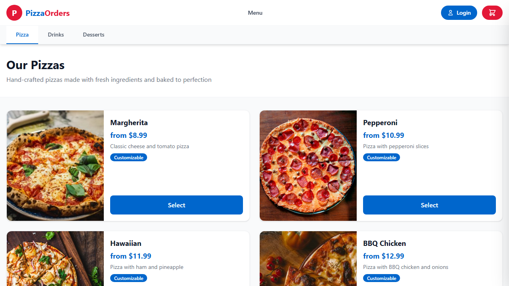

# PizzaOrders

A full-stack pizza ordering application built with **ASP.NET Core** and **React + TypeScript**, demonstrating Clean Architecture, real-time updates with SignalR, JWT authentication, and comprehensive testing.



## Features

- **Product Catalog** -- Browse pizzas, drinks, and desserts with customizable toppings
- **Shopping Cart** -- Session-based cart stored in Redis with real-time price calculation
- **Checkout Flow** -- Authenticated and guest checkout with automatic payment processing
- **Order Tracking** -- Real-time order status updates via SignalR WebSocket notifications
- **Admin Panel** -- Order management with workflow-based status transitions (Paid -> Accepted -> Preparing -> Ready -> Delivering -> Delivered -> Completed)
- **Authentication** -- JWT-based auth with refresh tokens, role-based authorization (User/Admin)
- **Image Management** -- Product image upload and storage via Azure Blob Storage (Azurite locally)

## Tech Stack

### Backend
| Technology | Purpose |
|---|---|
| .NET 10 / ASP.NET Core | Web API framework |
| Entity Framework Core | ORM with SQL Server |
| ASP.NET Core Identity | Authentication & user management |
| JWT Bearer | Token-based authorization |
| SignalR | Real-time WebSocket notifications |
| Redis | Distributed cache (cart storage) |
| Azure Blob Storage | Product image storage |
| .NET Aspire | Local orchestration & service discovery |

### Frontend
| Technology | Purpose |
|---|---|
| React 18 | UI framework |
| TypeScript | Type safety |
| Tailwind CSS | Styling |
| Redux Toolkit | State management |
| React Router | Client-side routing |
| @microsoft/signalr | Real-time updates |
| Vite | Build tool & dev server |

### Infrastructure
| Technology | Purpose |
|---|---|
| SQL Server | Primary database |
| Redis | Session/cart caching |
| Azurite | Local Azure Storage emulator |
| Docker | Containerized dependencies |
| GitHub Actions | CI pipeline |

## Architecture

The backend follows **Clean Architecture** with four layers:

```
PizzaOrders.sln
├── PizzaOrders.Domain          # Entities, value objects, enums (no dependencies)
├── PizzaOrders.Application     # Services, DTOs, interfaces, business logic
├── PizzaOrders.Infrastructure  # EF Core, data access, migrations
├── PizzaOrders.API             # Controllers, SignalR hubs, middleware
├── PizzaOrders.AppHost         # .NET Aspire orchestrator
├── PizzaOrders.ServiceDefaults # Health checks, OpenTelemetry
├── PizzaOrders.Tests           # Unit & integration tests
└── frontend/                   # React SPA
```

### Key Design Decisions

- **Monolithic architecture** -- intentionally simple, no microservices
- **Session-based cart** -- stored in Redis, no auth required to browse and add items
- **Order status workflow** -- state machine with defined transitions, exposed via `nextStatuses` in API responses
- **SignalR for real-time** -- customers see order status changes instantly without polling
- **Clean Architecture abstraction** -- `IOrderNotificationService` in Application layer, SignalR implementation in API layer

## Getting Started

### Prerequisites

- [.NET 10 SDK](https://dotnet.microsoft.com/download)
- [Node.js 22+](https://nodejs.org/)
- [Docker Desktop](https://www.docker.com/products/docker-desktop/)

### Option 1: Run with .NET Aspire (Recommended)

Aspire automatically starts SQL Server, Redis, and Azurite containers:

```bash
cd PizzaOrders.AppHost
dotnet run
```

Then start the frontend:

```bash
cd frontend
npm install
npm run dev
```

The app will be available at `http://localhost:3000`.

### Option 2: Run with Docker Compose

```bash
docker-compose up -d     # Start SQL Server, Redis, Azurite
dotnet run --project PizzaOrders.API
cd frontend && npm install && npm run dev
```

### Default Accounts

| Role | Email | Password |
|------|-------|----------|
| Admin | admin@pizzaorders.com | Admin123! |
| User | user@pizzaorders.com | User123! |

## API Endpoints

### Public
| Method | Endpoint | Description |
|--------|----------|-------------|
| GET | `/api/product?productType=0` | List products by type (0=Pizza, 1=Drink, 2=Starter) |
| GET | `/api/product/{id}` | Get product details |
| GET | `/api/topping` | List available toppings |
| POST | `/api/cart/create` | Create a new cart session |
| GET | `/api/cart/{sessionId}` | Get cart contents |
| POST | `/api/cart/{sessionId}/add` | Add item to cart |
| POST | `/api/checkout/{sessionId}/guest` | Guest checkout |

### Authenticated
| Method | Endpoint | Description |
|--------|----------|-------------|
| POST | `/api/auth/register-user` | Register |
| POST | `/api/auth/login-user` | Login |
| POST | `/api/auth/logout` | Logout |
| POST | `/api/auth/refresh-token` | Refresh JWT |
| GET | `/api/orders` | User's order history |
| GET | `/api/orders/{id}` | Order details |
| POST | `/api/checkout/{sessionId}` | Authenticated checkout |
| POST | `/api/payment/pay` | Process payment |

### Admin Only
| Method | Endpoint | Description |
|--------|----------|-------------|
| GET | `/api/management/orders` | All orders with workflow actions |
| GET | `/api/management/orders/{id}` | Order detail with next statuses |
| PUT | `/api/management/orders/{id}/status` | Update order status |

### Real-Time (SignalR)
| Hub | Event | Description |
|-----|-------|-------------|
| `/hubs/orders` | `OrderStatusUpdated` | Pushed when admin changes order status |

## Testing

### Test Summary

| Category | Tests | Framework |
|----------|-------|-----------|
| Unit Tests | 97 | NUnit + Moq + EF InMemory |
| Integration Tests | 45 | NUnit + Testcontainers (SQL Server + Redis) |
| E2E Tests | Playwright | Playwright + Chromium |
| **Total** | **142+** | |

### Run Tests

```bash
# Unit tests (no Docker required)
dotnet test --filter "Category!=Integration"

# Integration tests (requires Docker)
dotnet test --filter "Category=Integration"

# All tests
dotnet test

# Playwright E2E tests (requires full stack running locally)
cd frontend && npx playwright test
```

### What's Covered

- **AuthService** -- Login, register, logout, refresh token, role assignment
- **CheckoutService** -- Cart validation, order creation, payment processing, toppings
- **OrderService** -- User order history, order detail with modifiers
- **OrderManagementService** -- Status workflow transitions, SignalR notifications
- **PaymentService** -- Payment processing, amount validation, persistence
- **ProductService** -- Product listing by type, product detail
- **ProductManagementService** -- CRUD operations
- **ToppingManagementService** -- CRUD operations
- **CartService** -- Add/update/remove items, toppings pricing, session management
- **Integration** -- Full API flows for Auth, Orders, Cart, Checkout, Payment, Products, Admin + SignalR

## CI/CD

GitHub Actions pipeline with three parallel jobs:

1. **Unit Tests** -- Build, restore, run unit tests, upload coverage
2. **Integration Tests** -- Same + Testcontainers (SQL Server + Redis)
3. **Frontend Checks** -- TypeScript check, production build validation

Playwright E2E tests run locally against the full stack (backend + SQL Server + Redis + Azurite).

## Project Structure

```
frontend/
├── src/
│   ├── components/      # Reusable UI components (Header, CartSidebar, Modals)
│   ├── hooks/            # Custom hooks (useOrderSignalR, useReduxCart, useConfirm)
│   ├── pages/            # Page components (Home, Checkout, Orders, Admin, OrderTracking)
│   ├── services/         # API client
│   ├── store/            # Redux store & slices
│   └── types/            # TypeScript interfaces
├── e2e/                  # Playwright E2E tests
└── playwright.config.ts
```

## License

This is a personal learning/portfolio project.
